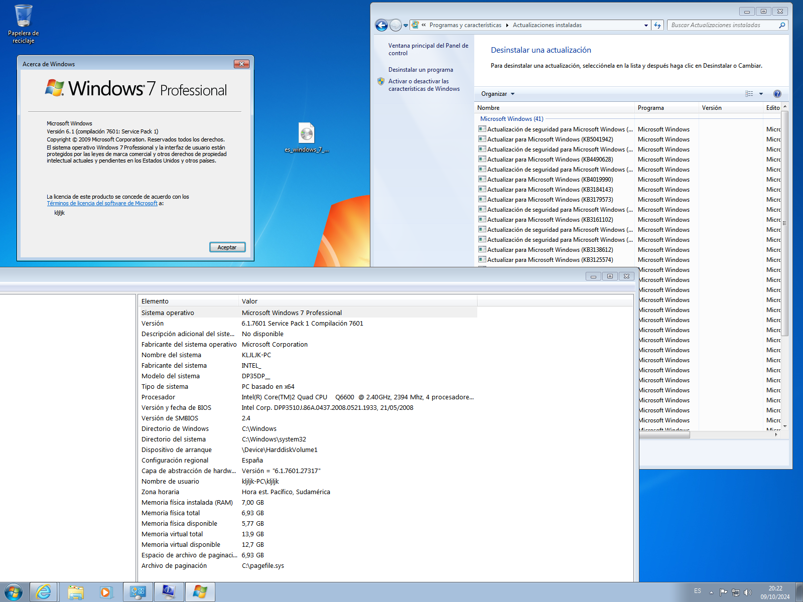

### 1) Windows 11 Pro 24H2 v26100.2314 x64 (5.84 GB)

Idioma: Español (Es-es)

— Actualizaciones integradas hasta el 12 de noviembre de 2024

— .Net Framework 3.5 incluido (incluidos 2.0 y 3.0)

— BitLocker automático está deshabilitado

— La verificación está deshabilitada durante la instalación y actualización (TPM, arranque de seguridad, CPU, almacenamiento y memoria RAM)

— Los sistemas no estaban en modo auditoría.

Link:
https://mega.nz/file/eIJAxbjY#rLZKNEcX3hSticQkAvYIiIyvDI1nOL91Svsdbd1GTgQ

### 2) Windows 11 Pro 23H2 v22631.4460 x64 (6.56 GB)

Idioma: Español (Es-es)

— Actualizaciones integradas hasta el 12 de noviembre de 2024

— .Net Framework 3.5 incluido (incluidos 2.0 y 3.0)

— BitLocker automático está deshabilitado

— La verificación está deshabilitada durante la instalación y actualización (TPM, arranque de seguridad, CPU, almacenamiento y memoria RAM)

— Los sistemas no estaban en modo auditoría.

Link:
https://mega.nz/file/bNZDlZZB#3UJNEzMYQp355lrVXH4SIeUfhrhifhrrub0AEPQiKJ4

### 3) Windows 8.1 update 9600.22267 (6,13 GB)

Idioma: Español (Es-es)

— Actualizaciones integradas hasta el 12 de noviembre de 2024

— Net Framework 4.8 integrado

— .Net Framework 3.5 incluido (incluidos 2.0 y 3.0)

— Los sistemas no estaban en modo auditoría

Link:
https://mega.nz/file/TAhgCYrB#RfWev0evnjRALJ-d8yjpEGzc8O86TaSUjx5ELqfWtPc

### 4) Windows 7 ultimate update 7601.27415 (4,65 GB)

Idioma: Español (Es-es)

— Actualizaciones integradas hasta el 12 de noviembre de 2024

— Los sistemas no estaban en modo auditoría.

Link:
https://mega.nz/file/uM431K6I#Gu0tl-olhPJx2N8GLqErYbvxgoFnlwTaKbVdpYuCM4g

### 3) Torrent to google drive v3 (fix) 14-01-2024

Link: https://colab.research.google.com/drive/17TY-1J7XhcwWul4nfZ4X5dBnbNXgOjvL?usp=sharing
